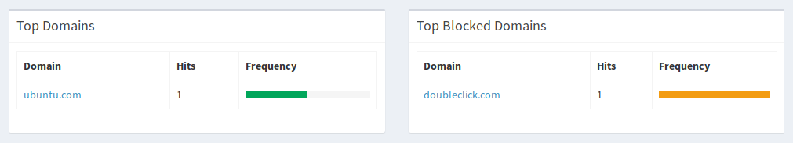
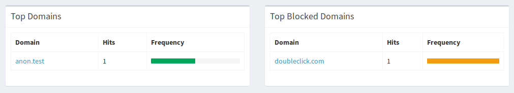

# Pi-hole Log Anonymiser
A systemd service to anonymise the logs of pihole in real time.

## Features
  * Anonymises all the allowed client request domains and IP address
  * Blocked Pi-holed domains and IP addresses are left visible
### Before

### After

## Why
Pi-hole allows you to monitor the performance and statistics on your network. However, in order to do this you must enable logging which exposes not only the blocked domains but also the allowed domains.

For the privacy conscious, this provides an alternative to disabling the logging altogether.

## References
[Pi-hole](https://pi-hole.net/)

[Dnsmasq-log-anonymiser](https://github.com/danchal/dnsmasq-log-anonymiser)

## Requirements
        Systemd
        Pi-hole

## Install
!! Warning - this will wipe the existing Pi-hole log and FTL database !!

        $ git clone https://github.com/danchal/pihole-log-anonymiser.git
        $ cd pihole-log-anonymiser
        $ git submodue init
        $ git submodule update
        $ sudo ./setup.sh

## Note
If you reconfigure Pi-hole then you must run the setup again. This is because Pi-hole will reset the dnsmasq log back to /var/log/pihole.log, thereby bypassing the dnsmasq-log-anonymiser.
